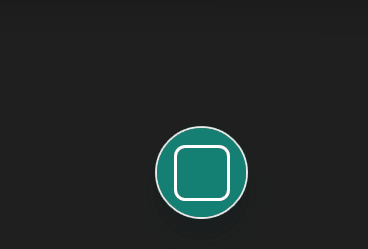

# Mini Capture

Mini Capture는 Windows에서 빠르게 화면을 캡처하고 바로 확인·표시·저장할 수 있는 가벼운 캡처 도구입니다. 화면 가장자리에 작은 캡처 버튼을 띄워 두고 영역, 창, 전체 화면, 타이머 캡처를 실행할 수 있습니다.

## 동작 미리보기

### 빠른 캡처 메뉴



### 캡처 라이브러리와 뷰어


## 포터블 버전 다운로드

1. [최신 릴리스](https://github.com/ai-blink/Mini-Capture/releases/latest)에서 `MiniCapture-v0.1.4-win-x64-portable.zip`을 내려받습니다.
2. ZIP 파일을 원하는 폴더에 압축 해제합니다.
3. `MiniCapture.exe`를 실행합니다.

설치 과정과 별도의 .NET 설치가 필요하지 않습니다. Windows SmartScreen이 처음 실행을 확인하면 파일 출처를 확인한 뒤 **추가 정보 → 실행**을 선택하세요.

> 포터블 폴더를 이동하면 이미지 기본 앱 후보 경로도 달라집니다. 이동한 폴더에서 `MiniCapture.exe`를 한 번 다시 실행하면 현재 경로가 등록됩니다.

## 주요 기능

- 항상 위에 표시되는 작은 캡처 버튼
- 영역 드래그, 창 선택, 전체 화면, 타이머의 네 가지 캡처 방식
- 캡처 결과를 PNG로 자동 저장
- PNG, JPG, JPEG 이미지를 열 수 있는 내장 뷰어
- 캡처 폴더를 탐색하는 Windows 탐색기형 미니 파일 브라우저
- 자세히, 작게, 중간, 크게의 네 가지 파일 보기
- 맞춤, 원본 크기, 확대/축소와 퍼센트 직접 입력
- 펜, 화살표, 네모, 원, 텍스트, 모자이크 마크업
- 마크업 선택·이동·크기 조절·삭제와 실행 취소/다시 실행
- 이미지 복사, 파일 경로 복사, 저장 및 폴더 열기
- 파일 목록 새로고침(F5)과 자세히 보기 열 정렬
- 픽셀 영역 선택·복사·잘라내기·붙여넣기와 이미지 가장자리 자르기
- 창 지정에서 제외할 실행 파일 목록 관리
- 창 위치, 파일 보기 방식, 탐색기 패널 너비 유지

## 사용 방법

### 캡처하기

화면 가장자리의 Mini Capture 버튼을 클릭한 뒤 원하는 방식을 선택합니다.

- **영역**: 마우스로 원하는 영역을 드래그합니다.
- **창**: 캡처할 창 위로 이동한 뒤 선택합니다.
- **전체**: 전체 화면을 즉시 캡처합니다.
- **타이머**: 지정한 시간이 지난 뒤 선택한 화면을 캡처합니다.

캡처 파일은 기본적으로 다음 폴더에 날짜별로 저장됩니다.

```text
C:\Users\<사용자 이름>\Pictures\MiniCapture\연도\월\일
```

### 이미지 확인 및 편집

캡처 결과에서 뷰어를 열거나 PNG/JPG/JPEG 파일을 `MiniCapture.exe`로 열 수 있습니다. 뷰어 상단에서 파일 이동, 맞춤, 원본 크기, 확대/축소, 회전과 마크업 도구를 사용할 수 있습니다.

확대/축소 퍼센트 입력란에는 `125` 또는 `125%`처럼 입력할 수 있으며 지원 범위는 10%~800%입니다. 최하단 상태바의 슬라이더로도 배율을 조절할 수 있습니다.

### 창 제외 기준 선택

**설정 → 창 제외**에서 실행 중인 프로세스를 선택하면 확인 가능한 실행 파일 경로와 프로세스명이 함께 저장되고, 기본 적용 기준도 자동으로 파일 경로가 됩니다. 기존 프로세스명 전용 항목도 나중에 경로가 확인되면 파일 경로 기준으로 갱신됩니다. Windows가 실제로 경로 조회를 막는 보호 프로세스만 프로세스명 기준으로 추가됩니다. 이후에는 라디오 버튼으로만 적용 기준을 전환하며, 전환해도 두 값은 유지됩니다.

### 자주 쓰는 단축키

| 단축키 | 동작 |
| --- | --- |
| `Ctrl+S` | 현재 이미지 저장 |
| `Ctrl+C` | 선택한 픽셀 영역 복사(선택이 없으면 마크업 포함 이미지 복사) |
| `Ctrl+X` | 선택한 픽셀 영역 잘라내기 |
| `Ctrl+V` | 선택 영역 위치에 이미지 붙여넣기 |
| `Ctrl+Shift+C` | 파일 경로 복사 |
| `Ctrl+Z` / `Ctrl+Y` | 실행 취소 / 다시 실행 |
| `←` / `→` | 이전 / 다음 이미지 |
| `+` / `-` | 확대 / 축소 |
| `1` | 원본 크기 |
| `F` | 창에 맞춤 |
| `F5` | 현재 폴더 새로고침 |
| `Delete` | 선택한 마크업 삭제 |
| `Space` | 누르는 동안 핸드 도구 사용 |

### 이미지 확장자 기본 앱으로 선택하기

Mini Capture는 실행 시 현재 사용자 계정에 PNG/JPG/JPEG를 열 수 있는 앱 후보로 등록됩니다. 다른 이미지 확장자도 설정 창에서 추가할 수 있습니다. Windows 정책상 기존 기본 앱을 강제로 바꾸지는 않습니다.

1. Mini Capture의 **설정 → 확장자 연결**을 엽니다.
2. 다른 확장자가 필요하면 `.bmp`처럼 입력하고 **확장자 등록**을 누릅니다.
3. **Windows 기본 앱에서 선택하기**를 누릅니다.
4. 해당 확장자의 기본 앱을 **Mini Capture Viewer**로 선택합니다.

## 시스템 요구 사항

- Windows 10 또는 Windows 11
- 64비트 Windows (`win-x64`)
- 캡처와 저장을 위한 사용자 Pictures 폴더 접근 권한

## 개인정보 및 네트워크

Mini Capture는 캡처 이미지를 사용자 PC에만 저장합니다. V1에는 계정, 클라우드 업로드, 원격 공유, 사용 분석 기능이 없습니다.

## 소스에서 빌드하기

.NET 8 SDK가 필요합니다.

```powershell
dotnet build .\MiniCapture.slnx
dotnet run --project .\src\MiniCapture\MiniCapture.csproj
```

이미지 파일을 뷰어로 바로 열려면 파일 경로를 인자로 전달합니다.

```powershell
dotnet run --project .\src\MiniCapture\MiniCapture.csproj -- "C:\path\to\image.png"
```

## 포터블 패키지 만들기

```powershell
dotnet publish .\src\MiniCapture\MiniCapture.csproj `
  -c Release `
  -r win-x64 `
  --self-contained true `
  -p:PublishSingleFile=true `
  -p:IncludeNativeLibrariesForSelfExtract=true `
  -p:EnableCompressionInSingleFile=true `
  -p:DebugType=None `
  -o .\artifacts\publish\MiniCapture-v0.1.4-win-x64-portable
```

## V1 범위

V1은 안정적인 화면 캡처, 자동 저장, 빠른 확인, 간단한 표시와 캡처 폴더 탐색에 집중합니다. OCR, 클라우드 업로드, 스크롤 캡처, 동영상/GIF 녹화, 무거운 이미지 편집과 범용 파일 관리는 포함하지 않습니다.

## 버전

- 현재 포터블 공개 버전: `v0.1.4`
